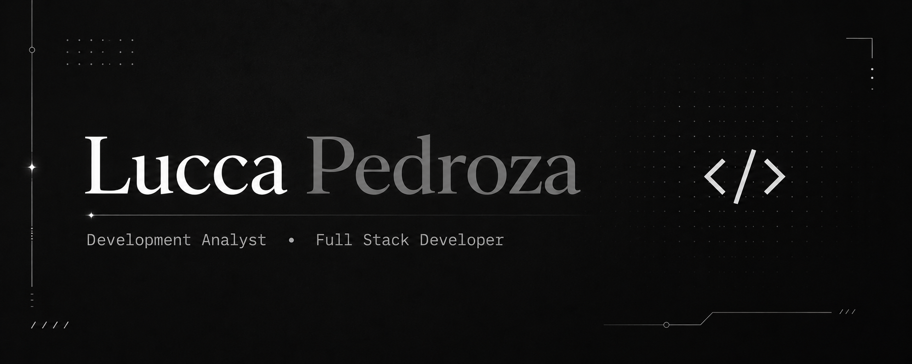

  

 

 

<h2 align="center">TECH STACK</h2>

  

<h2 align="center">📊 GitHub Stats</h2>

  

<picture>
  <source media="(prefers-color-scheme: dark)" srcset="https://github.com/luccapedev/luccapedev/blob/output/github-snake-dark.svg">
  <source media="(prefers-color-scheme: light)" srcset="https://github.com/luccapedev/luccapedev/blob/output/github-snake.svg">
  
</picture>
